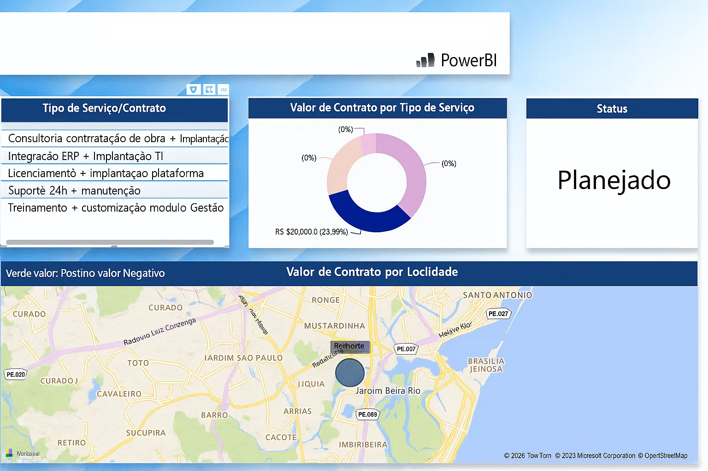

Power BI Portfolio – Dashboard e Demonstração de Competências em SQL
Este repositório apresenta uma implementação demonstrativa de dashboard feita com Power BI, com o objetivo de evidenciar minhas habilidades em manipulação de dados, criação de relatórios visuais e preparação para integração com bases de dados SQL.

git clone https://github.com/AlexadraCampos/portfolio-powerbi.git 

Acesse também por https://portfolio-powerbi.netlify.app/

📸 Demonstração

